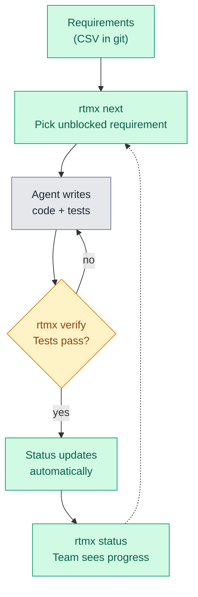
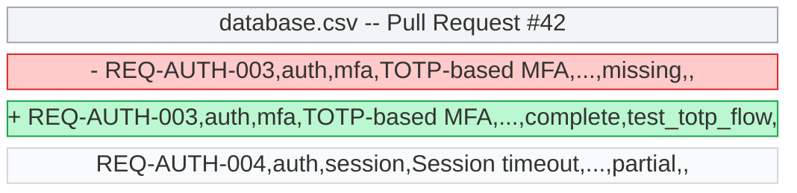
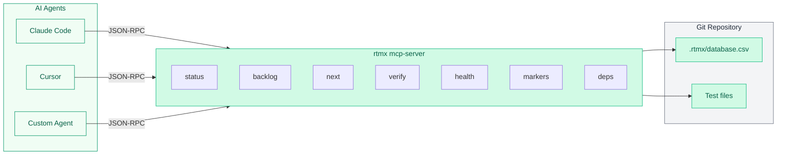
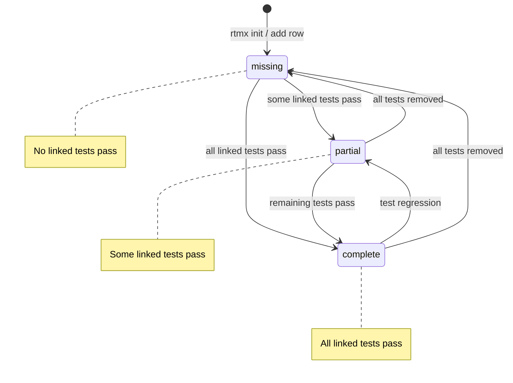

# Show HN: RTMX -- Git-native requirements traceability for AI-assisted development

**Title**: Show HN: RTMX -- Track what you built, what's tested, and what's next, from the terminal

**URL**: https://github.com/rtmx-ai/rtmx

---

## Post Text

I spent a year cleaning up after AI agents. They write code fast, but they build the wrong thing. The fix wasn't better prompts -- it was giving agents a queryable, verifiable requirements model that lives in git.

RTMX is a CLI tool that manages a requirements traceability matrix (RTM) as a CSV file in your repo. Every requirement has an ID, a spec, and linked tests. Status isn't manually updated -- it's derived from test results. If the tests pass, the requirement is complete. If they don't, you know exactly what's broken.

**What it does:**

- `rtmx status` -- completion dashboard across all requirements and phases
- `rtmx backlog` -- prioritized work items with dependency-aware critical path
- `rtmx verify` -- cross-language test verification (auto-detects Go, Python, Rust, Node.js, Java, Elixir, Swift, Dart, Ruby -- 10+ frameworks)
- `rtmx health` -- validate your RTM for orphaned tests, missing specs, circular dependencies
- `rtmx next` -- dependency graph analysis that finds independent work webs and picks the highest-priority unblocked requirement
- MCP server with 7+ tools -- AI agents (Claude, Cursor) can query and update your requirements in real-time, with atomic claim/release for multi-agent coordination

**Why CSV in git?**

- Human-readable diffs in PRs
- Works offline, air-gapped, on any machine
- AI agents can parse it without an API
- No SaaS, no database, no vendor lock-in
- `git blame` tells you when and why every requirement changed

**Technical details:**

- Single static binary, zero runtime dependencies (Go, CGO_ENABLED=0)
- Linux, macOS, Windows -- amd64 and arm64
- 2 external dependencies total (Cobra + YAML parser)
- GPG-signed releases with SBOM
- Apache 2.0

**The part I'm most proud of:** RTMX manages its own requirements. The RTM for RTMX is tracked by RTMX -- 219 requirements, auto-verified in CI, with dependency graphs and critical path analysis running on every push.

**The AI workflow:** An agent runs `rtmx next --one` and gets a specific, unblocked requirement to implement. It writes code and tests using the requirement spec. `rtmx verify` confirms the tests pass. The requirement status updates automatically. No human had to triage, assign, or update a ticket.

I built this because I needed it. I work on defense software and radar systems where requirements traceability isn't optional. But even for teams that don't need compliance, knowing which requirements have passing tests and which are blocked is transformative when you have AI agents writing code all day.

Install: `brew install rtmx-ai/tap/rtmx` or grab a binary from releases.

Docs: https://rtmx.ai

I'd love feedback on:
- The CLI design and workflow
- Whether the CSV-in-git approach makes sense for your team
- What integrations would make this useful for you
- Use cases I haven't considered

---

## Media Assets

Each asset below should be produced before posting. All screenshots and GIFs
use the RTMX project's own 219-requirement database (dogfooding, not a demo).

### README hero image

**File:** `docs/assets/rtmx-hero.png`
**Description:** A single terminal screenshot showing `rtmx status` output
against the real 219-requirement database. The progress bar, phase breakdown,
and completion percentage should be visible. Dark terminal background with
the green/yellow/red status colors.
**Purpose:** First thing a visitor sees on the GitHub repo. Must communicate
"this is a real, mature tool" at a glance.

### GIF 1: The 30-second workflow

**File:** `docs/assets/rtmx-workflow.gif`
**Duration:** 25-30 seconds
**Sequence:**
1. `rtmx status` -- flash the dashboard (3s)
2. `rtmx next --one` -- pick the next requirement (3s)
3. Show the requirement ID and description
4. `rtmx verify` -- run tests (5s, show progress)
5. `rtmx status` -- show the completion tick up (3s)

**Purpose:** Tells the full story without reading a word. Embed in README
and link from the HN post URL. This is the single most important asset.

### GIF 2: AI agent loop

**File:** `docs/assets/rtmx-agent-loop.gif`
**Duration:** 15-20 seconds
**Sequence:**
1. Show an AI agent (Claude Code or Cursor) calling `rtmx next --one`
2. Agent receives requirement spec as structured output
3. Agent writes a test file
4. `rtmx verify` passes
5. Requirement flips from MISSING to COMPLETE

**Purpose:** Makes the AI-agent story concrete. "Agents don't just write code,
they write the right code." This is the differentiator from every other
project management tool.

### Screenshot: backlog with critical path

**File:** `docs/assets/rtmx-backlog-full.png`
**Description:** `rtmx backlog` output against the real database. Must show
the critical path items, quick wins section, and the remaining requirements
table with priority colors and dependency indicators.
**Purpose:** Shows the prioritization engine. Answers "how does it decide
what to work on next?"

### Screenshot: health check

**File:** `docs/assets/rtmx-health-full.png`
**Description:** `rtmx health` output against the real database. Should show
a mix of PASS, WARN, and SKIP results to demonstrate the validation checks.
**Purpose:** Shows the integrity guarantees. Appeals to the compliance and
defense audience.

### Screenshot: MCP server tools

**File:** `docs/assets/rtmx-mcp-tools.png`
**Description:** The MCP tool list as seen from Claude Code or Cursor --
showing the 7+ available tools with their descriptions. Alternatively,
a screenshot of an AI agent mid-conversation querying `rtmx status` via MCP.
**Purpose:** Makes MCP integration tangible for developers already using
AI coding assistants.

### Diagram: how RTMX fits in the development loop

**File:** `docs/diagrams/dev-loop.mmd`
**Format:** Mermaid (rendered to SVG/PNG via `mmdc` or GitHub native rendering)
**Purpose:** The "explain it to my manager" diagram. Shows where RTMX sits
without requiring the reader to understand RTMs, TDD, or MCP.

### Diagram: CSV diff in a PR

**File:** `docs/diagrams/csv-diff.mmd`
**Format:** Mermaid (rendered to SVG/PNG via `mmdc` or GitHub native rendering)
**Purpose:** Answers the #1 skepticism: "why CSV?" One image makes it click.

### Diagram: MCP agent architecture

**File:** `docs/diagrams/mcp-architecture.mmd`
**Format:** Mermaid (rendered to SVG/PNG via `mmdc` or GitHub native rendering)
**Purpose:** Shows how AI agents interact with RTMX via MCP -- makes
multi-agent coordination tangible.

### Diagram: requirement lifecycle

**File:** `docs/diagrams/requirement-lifecycle.mmd`
**Format:** Mermaid (rendered to SVG/PNG via `mmdc` or GitHub native rendering)
**Purpose:** Shows the state machine for a single requirement -- how status
is derived from test results, not manual updates.

---

## Production Notes

- All terminal screenshots: use a clean terminal profile with dark background,
  no custom prompt decorations, reasonable font size (14-16pt).
- GIFs: use vhs (https://github.com/charmbracelet/vhs) for reproducible
  terminal recordings from `.tape` files. Keep frame rate low (10-15fps)
  to reduce file size. Tape files live in `docs/tapes/` and are versioned.
- Diagrams: all diagrams are Mermaid (`.mmd` files in `docs/diagrams/`).
  Render to SVG/PNG via `mmdc` (Mermaid CLI) or rely on GitHub's native
  Mermaid rendering in markdown. Use the rtmx.ai color palette
  (emerald #10b981 / #6ee7b7 on dark #0a0a0a / #1c1917).
  To render locally: `npx @mermaid-js/mermaid-cli -i docs/diagrams/dev-loop.mmd -o docs/assets/dev-loop.svg -t dark`
- All assets should be committed to the rtmx repo under docs/assets/
  (rendered output) and docs/diagrams/ (Mermaid source), and referenced
  from README.md.
- Existing screenshots (rtmx-status.png, rtmx-backlog.png, rtmx-health.png)
  should be regenerated against the real 219-requirement database, replacing
  the 12-requirement demo versions.

---

## Timing

Post on a Tuesday or Wednesday, 8-10am ET (peak HN traffic).

## Response Strategy

- Monitor for the first 6 hours minimum
- Respond to every substantive comment
- Capture feedback as GitHub issues tagged `community-feedback`
- The post is about rtmx (the CLI). Do not volunteer information about
  rtmx-sync or paid products in the post or unprompted in comments.
  If asked about team collaboration or real-time sync, respond directly:
  "Single-player works through git -- commit and push your CSV. For
  real-time multi-user sync, we're building a commercial collaboration
  server." No hedging, no apology. The CLI is the complete product.
- Common questions to prepare for:
  - "Why not Jira?" -- Different category. RTMX is traceability, not project management. They work together.
  - "How does this scale?" -- CSV works fine for hundreds of requirements. Thousands would need indexing.
  - "What about non-Python/Go?" -- Auto-detects 10+ languages/frameworks. Results JSON format is language-agnostic.
  - "Why Go?" -- Single static binary, fast startup, cross-platform. Python CLI still available but deprecated.
  - "Is this just for AI teams?" -- No. Any team doing TDD benefits. AI workflows just make it more urgent.
  - "How is this different from test coverage?" -- Coverage tells you what code is tested. RTMX tells you what requirements are tested. A project can have 100% code coverage and still be missing features.
  - "Why not YAML/TOML/JSON?" -- CSV diffs cleanly in git, opens in any spreadsheet, and is trivially parseable by AI agents. One row = one requirement.
  - "How does this work with a team?" -- Through git. Your CSV is in the repo; commit, push, and PR like any other file. Git blame gives you full audit trail. For real-time collaboration we're building a commercial sync server.
  - "Is this open core?" -- The CLI is Apache 2.0 and fully featured. There is nothing gated or crippled. We sell collaboration infrastructure separately for teams that need real-time sync.

## Cross-posting (after HN settles)

- Reddit: r/programming, r/golang, r/commandline
- Dev.to: Longer-form article version
- LinkedIn: Professional angle for enterprise/defense audience
