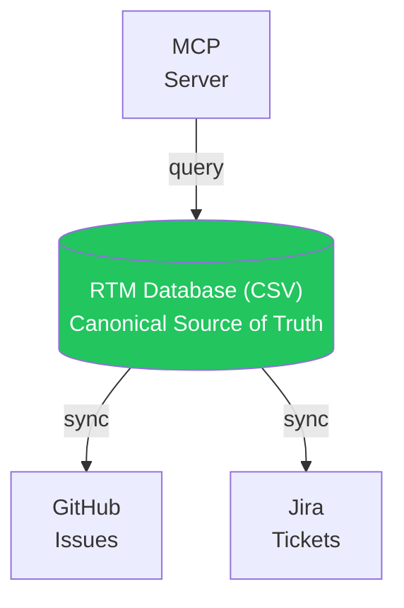

RTMX adapters synchronize your requirements database with external services like GitHub Issues and Jira.

## Available Adapters

| Adapter | Description |
|---------|-------------|
| [GitHub](/adapters/github) | Sync with GitHub Issues |
| [Jira](/adapters/jira) | Sync with Jira tickets |
| [MCP](/adapters/mcp) | AI agent integration via Model Context Protocol |

## Architecture



## Sync Philosophy

RTMX uses **CSV as the canonical store**:

1. **Git-friendly**: CSV diffs are human-readable
2. **AI-parseable**: Token-efficient for LLM context
3. **Portable**: No vendor lock-in
4. **Audit-ready**: Full history via git

External services receive **one-way pushes** from the RTM:

```bash
rtmx sync github    # Push changes to GitHub
rtmx sync jira      # Push changes to Jira
```

## Delta Tracking

RTMX tracks changes efficiently:

```python
# Only sync requirements that changed
delta = db.compute_delta(previous_state)
# Returns: { added: [...], changed: [...], removed: [...] }
```

This minimizes API calls and avoids rate limits.

## Configuration

Enable adapters in `rtmx.yaml`:

```yaml
rtmx:
  github:
    enabled: true
    repo: owner/repo
  jira:
    enabled: true
    url: https://your-org.atlassian.net
    project_key: PROJ
```

## Security

- Credentials stored in environment variables
- No tokens in config files
- Minimal permission scopes requested
