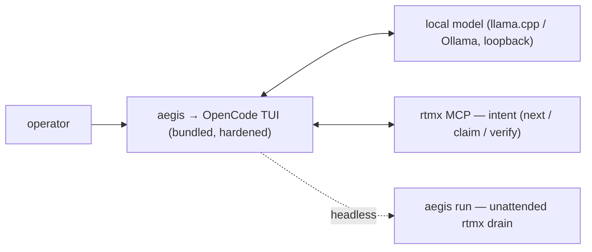

aegis brings a top-tier agentic coding experience to closed, air-gapped environments. This page gets you
from install to your first requirement closed — all loopback-only.

## Install

### macOS (Apple Silicon) / Linux — Homebrew

```bash
brew install rtmx-ai/tap/aegis
```

### Debian / Ubuntu

Download `aegis_<version>_<arch>.deb` from the [signed releases](https://github.com/rtmx-ai/aegis-cli/releases),
verify it (see [Security & Compliance](/aegis/security)), then `sudo apt install ./aegis_<version>_amd64.deb`.

The model GGUF is **side-loaded separately** — too large to package, and an air gap wants it staged
deliberately. See [Operator & Air-Gap](/aegis/operator).

## First run

```bash
aegis verify-env      # confirm the environment is closed + traceable
aegis                 # launch the hardened OpenCode TUI, driven by the local model
aegis run --once      # or drive one requirement headless, then stop
```

`aegis` launches the bundled OpenCode TUI wired to the local model and to rtmx as the intent layer. You
pick a requirement, the agent works it, and closure is decided by **running the requirement's linked
test** — never by the model's own say-so.

## Core concepts

- **Closed by construction.** No component makes a network call beyond loopback to the local model.
- **Bundle, don't rebuild.** aegis bundles and launches OpenCode (MIT) — it does not fork it.
- **rtmx is the intent layer.** Work is scoped by human-authored, test-linked requirements, one at a time.



## Where next

- [Using aegis](/aegis/using) · [Operator & Air-Gap](/aegis/operator) · [Security & Compliance](/aegis/security)

:::note[Canonical docs]
Full detail in the [aegis-cli repo](https://github.com/rtmx-ai/aegis-cli): [README](https://github.com/rtmx-ai/aegis-cli/blob/main/README.md) · [operator-guide](https://github.com/rtmx-ai/aegis-cli/blob/main/docs/operator-guide.md).
:::
