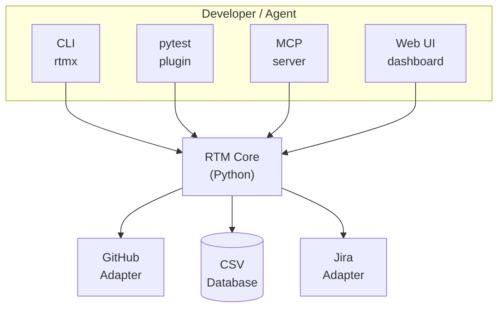

## System Overview



## Core Components

### RTMDatabase

The central data model:

```python
class RTMDatabase:
    """Manages requirements traceability data."""

    def load(path: Path) -> RTMDatabase:
        """Load from CSV file."""

    def save(path: Path) -> None:
        """Save to CSV file."""

    def filter(**kwargs) -> list[Requirement]:
        """Filter requirements by criteria."""

    def validate() -> list[ValidationError]:
        """Validate database integrity."""

    def find_cycles() -> list[list[str]]:
        """Detect circular dependencies."""

    def critical_path() -> list[str]:
        """Find critical path through dependencies."""
```

### Requirement

Individual requirement record:

```python
@dataclass
class Requirement:
    req_id: str
    category: str
    requirement_text: str
    status: Status
    priority: Priority | None
    phase: int | None
    dependencies: list[str]
    blocks: list[str]
    # ... additional fields
```

### Status Enum

```python
class Status(Enum):
    COMPLETE = "COMPLETE"
    PARTIAL = "PARTIAL"
    MISSING = "MISSING"
    NOT_STARTED = "NOT_STARTED"
    WIP = "WIP"
    BLOCKED = "BLOCKED"
```

## Module Structure

```
src/rtmx/
├── __init__.py          # Public API exports
├── models.py            # Requirement, RTMDatabase
├── config.py            # RTMXConfig, load_config()
├── graph.py             # Dependency analysis
├── validation.py        # Database validation
├── schema.py            # Schema definitions
├── cli/                 # Click CLI commands
│   ├── main.py          # CLI entry point
│   ├── status.py        # rtmx status
│   ├── backlog.py       # rtmx backlog
│   ├── health.py        # rtmx health
│   └── ...
├── adapters/            # External integrations
│   ├── github.py        # GitHub adapter
│   ├── jira.py          # Jira adapter
│   └── mcp/             # MCP server
│       ├── server.py
│       └── tools.py
├── pytest/              # pytest plugin
│   └── plugin.py
└── web/                 # Web UI (optional)
    ├── app.py
    ├── routes/
    └── templates/
```

## Design Decisions

### CSV as Canonical Store

**Decision**: Use CSV files as the primary data format.

**Rationale**:
- Git-friendly: Human-readable diffs
- AI-parseable: Fits in LLM context windows
- Portable: No database dependencies
- Audit-ready: Full history via git

### Lazy CLI Imports

**Decision**: Import modules lazily in CLI commands.

**Rationale**:
- Fast startup time
- Only load what's needed
- Reduces memory footprint

```python
@main.command()
def status():
    from rtmx.cli.status import run_status
    run_status()
```

### Dependency Graph with Tarjan's Algorithm

**Decision**: Use Tarjan's SCC algorithm for cycle detection.

**Rationale**:
- O(V+E) time complexity
- Identifies strongly connected components
- Battle-tested algorithm

### Pydantic-style Validation

**Decision**: Use dataclasses with explicit validation.

**Rationale**:
- Type safety without runtime overhead
- Clear validation errors
- No external dependencies

## Extension Points

### Custom Schemas

Define custom fields in configuration:

```yaml
rtmx:
  custom_fields:
    - name: compliance_ref
      type: string
```

### Custom Adapters

Implement the adapter interface:

```python
class CustomAdapter:
    def sync(self, db: RTMDatabase) -> SyncResult:
        """Push changes to external service."""

    def fetch(self) -> list[Requirement]:
        """Pull changes from external service."""
```

### MCP Tools

Add custom MCP tools:

```python
@mcp_tool("custom_analysis")
def custom_analysis(db: RTMDatabase, **params):
    """Custom analysis tool."""
    return {"result": "..."}
```

## Performance Considerations

### Large Databases

For databases with 1000+ requirements:

- Use `rtmx status` without `-vvv` for speed
- Filter operations with `--filter`
- Use delta tracking for syncs

### Memory Usage

- RTMDatabase is loaded into memory
- For very large databases, consider pagination
- Streaming support planned for v1.0

### CI Performance

Optimize CI runs:

```yaml
- run: rtmx health --quick  # Skip expensive checks
- run: rtmx status          # Summary only
```
