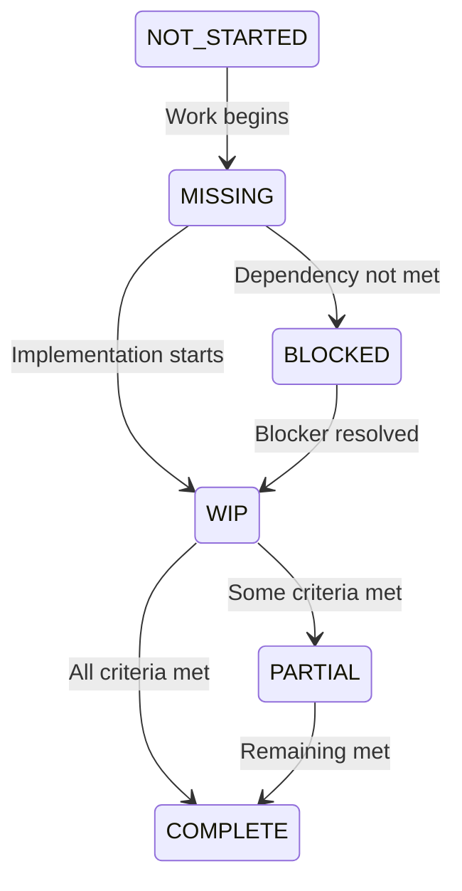
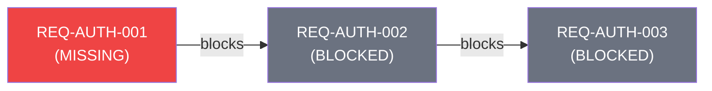

RTMX tracks requirements through their complete lifecycle from creation to completion.

## Status States



| Status | Description |
|--------|-------------|
| `NOT_STARTED` | Requirement defined but not yet worked on |
| `MISSING` | Implementation not present |
| `WIP` | Actively being worked on |
| `PARTIAL` | Partially implemented |
| `COMPLETE` | Fully implemented and tested |
| `BLOCKED` | Cannot progress due to dependencies |

## Status Transitions

### Valid Transitions

| From | To | Trigger |
|------|------|---------|
| `NOT_STARTED` | `MISSING` | Work begins |
| `MISSING` | `WIP` | Implementation starts |
| `WIP` | `PARTIAL` | Some acceptance criteria met |
| `WIP` | `COMPLETE` | All criteria met, tests pass |
| `PARTIAL` | `COMPLETE` | Remaining criteria met |
| `ANY` | `BLOCKED` | Dependency not met |
| `BLOCKED` | `WIP` | Blocker resolved |

### Status Update

```bash
# Via CLI
rtmx update REQ-AUTH-001 --status COMPLETE

# Via Python API
db.update("REQ-AUTH-001", status=Status.COMPLETE)

# Via MCP
rtmx_update_status(req_id="REQ-AUTH-001", status="COMPLETE")
```

## Dependency Management

### Blocking Relationships

Requirements can depend on other requirements:

```csv
REQ-AUTH-002,...,dependencies=REQ-AUTH-001|REQ-DB-001
```

### Automatic Blocking

When a dependency is incomplete, downstream requirements show as blocked:



### Unblocking

When a blocker completes, downstream requirements are automatically unblocked:

```bash
rtmx update REQ-AUTH-001 --status COMPLETE
# REQ-AUTH-002 and REQ-AUTH-003 are now unblocked
```

## Phase Management

Requirements can be grouped into phases:

```csv
REQ-AUTH-001,...,phase=1
REQ-DATA-001,...,phase=2
```

### Phase Progress

```bash
rtmx status --phase 1
# Phase 1: 85% complete (17/20 requirements)
```

### Phase Dependencies

Requirements should depend on earlier phases completing:

```csv
REQ-PHASE2-001,...,phase=2,dependencies=REQ-PHASE1-010
```

## Verification Methods

| Method | Description |
|--------|-------------|
| `Unit Test` | Automated unit test |
| `Integration Test` | Automated integration test |
| `System Test` | End-to-end system test |
| `Inspection` | Manual code review |
| `Demonstration` | Live demo/walkthrough |
| `Analysis` | Design analysis/review |

## Audit Trail

All status changes are tracked via git:

```bash
git log --oneline -- docs/rtm_database.csv
# a1b2c3d Update REQ-AUTH-001 to COMPLETE
# d4e5f6g Add REQ-DATA-003
```

### Generating History

```bash
rtmx history REQ-AUTH-001
# 2024-01-15 09:30: NOT_STARTED → MISSING (initial)
# 2024-01-16 14:22: MISSING → WIP (alice)
# 2024-01-18 11:45: WIP → COMPLETE (alice)
```

## Best Practices

### Keep Status Current

Update status immediately when work state changes:

```bash
# Starting work
rtmx update REQ-AUTH-001 --status WIP

# Hit a blocker
rtmx update REQ-AUTH-001 --status BLOCKED --notes "Waiting on API spec"

# Completed
rtmx update REQ-AUTH-001 --status COMPLETE
```

### Link Tests Early

Add test markers before implementation:

```python
@pytest.mark.req("REQ-AUTH-001")
def test_oauth_login():
    pytest.skip("Not implemented yet")
```

### Document Blockers

When blocked, document the reason:

```bash
rtmx update REQ-AUTH-002 --status BLOCKED \
  --notes "Blocked by external API dependency, ETA 2024-02-01"
```
